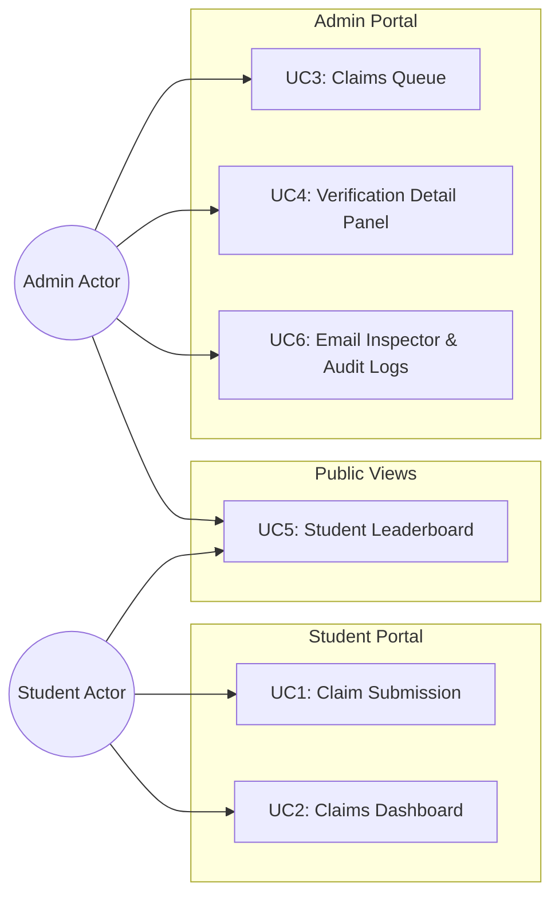
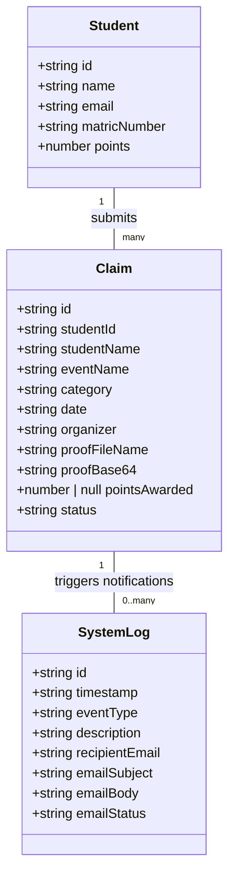
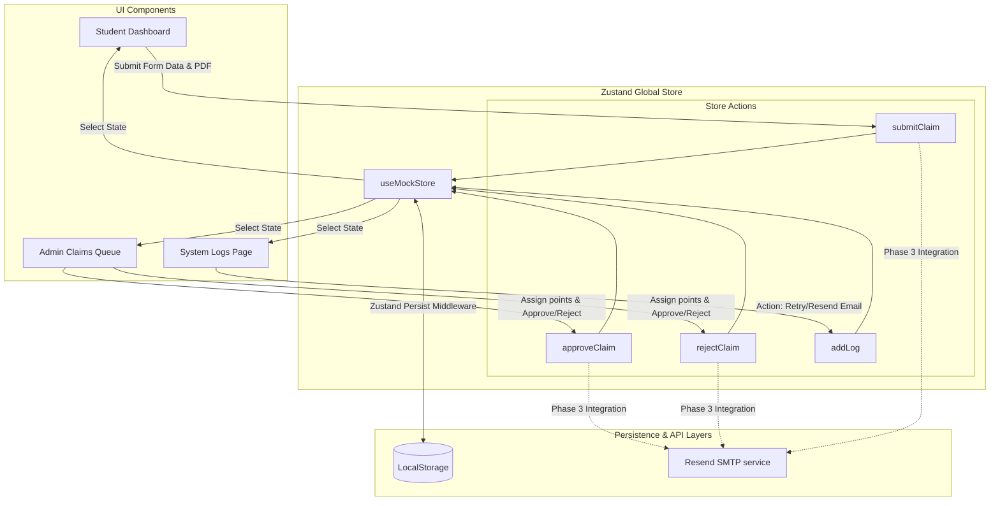

# Merit Activity Records System (MARS): Formal Assignment Report Outline

---

## 1. Introduction

### 1.1 Academic Assignment Scope
This report documents the architectural design, implementation workflow, and iterative refinement of the **Merit Activity Records System (MARS)** (initially prototyped as "Community Merits"). Developed as a modern student merit tracking platform, this system allows students to submit claims for co-curricular achievements and enables administrators to verify, award points, and audit transactional dispatches.

### 1.2 Focus on Extreme Prototyping Methodology (EPM)
Unlike conventional software projects that focus heavily on acquiring immediate end-users or deploying premature infrastructure, this system was developed using the **Extreme Prototyping Methodology (EPM)**. Under EPM:
- The focus remains on rapid UI/UX modeling, state synchronization, and validating usability constraints.
- System complexities are deferred or simulated through high-fidelity mocks until requirements are fully stabilized.
- Iterative cycles are used to pressure-test layout mechanics, data persistence structures, and integration boundaries.

### 1.3 Iterative Evolution & Feedback Loops
Development is strictly managed through horizontal, iterative releases (e.g., Iteration 1 to Iteration 4). The system evolves by capturing user complaints and acceptance criteria in dedicated files under `docs/uat/` at the end of each iteration. These issues are systematically addressed in the subsequent iteration by moving across three implementation phases, ensuring that code updates are scoped, verified, and backward-compatible.

---

## 2. What We're Building

### 2.1 Functional Scope: The 6 Use Cases
The application is structured around six core use cases that define student and administrator interactions:

1. **UC1: Student Claim Submission**
   - Students access the dashboard and open the claim submission form.
   - Input fields: Event Name, Category, Date, Organizer, and Proof Document.
   - Verification checks (e.g., compulsory inputs, file-type validation) must be met before submission.
   - Proof documents (PDF certificates) are encoded into Base64 format for client-side storage.
   - Submission triggers confirmation logs and simulated transactional emails.

2. **UC2: Student Claims Dashboard**
   - Displays a dynamic overview of the student's metrics (total approved merit points) and profile summary.
   - Renders a table of past claims, tracking their progress through live badges: `PENDING` (yellow), `APPROVED` (green), or `REJECTED` (red).

3. **UC3: Admin Claims Queue**
   - A dedicated verification inbox for system administrators.
   - Lists all claims in the system with filter capabilities (e.g., by status) and badge counters showing the total number of pending claims.

4. **UC4: Admin Verification Detail Panel (Split-Screen)**
   - Selecting a claim from the queue splits the view:
     - **Left Panel**: Displays detailed metadata about the claim (student name, matric number, category, date, organizer).
     - **Right Panel**: A Certificate Preview canvas that processes and renders the student's uploaded Base64 PDF proof using client-side `pdf.js` (falling back to a mock image if empty).
   - Administrators assign a numeric points value and click "Approve" or "Reject".

5. **UC5: Student Leaderboard**
   - A public page showing top performers with a visual podium for the top 3 students.
   - A complete ranking table displays all registered students.
   - Cumulative points and positions recalculate dynamically from approved claims in the store.

6. **UC6: Transactional Email Notification System (Running Simulator)**
   - Automatically records logs of simulated email transmissions triggered by claim submissions and administrative decisions.
   - Features an **Email Inspector Drawer** that slides open from the right (45% width on desktop) to display fully styled email templates.
   - Admins can trigger actions directly (Retry Delivery, Force Send, Resend Email) to update log statuses in real-time.

### 2.2 System Diagrams

#### 2.2.1 Mermaid Use Case Diagram
The diagram below details how actors interact with each use case in the system:



#### 2.2.2 Mermaid Class Diagram (TypeScript Models)
The system models are defined in `src/types/claims.ts`. Below is the UML representation of these types:



---

## 3. How We're Building It

### 3.1 Technology Stack & Tools
* **Next.js (App Router)**: Supports server-side layouts, React hydration handling, and routing architecture.
* **Tailwind CSS v4**: Provides modern layout utilities for responsive web layouts and interface components.
* **Zustand**: A lightweight, client-side global state store that operates as an in-memory database simulator.
* **LocalStorage**: Used to store user state, active phases, and claim data across browser sessions.
* **Resend**: Integrated for real-world SMTP email notifications in production.
* **pdfjs-dist**: Used on the client-side to render base64 PDF uploads on an HTML5 `<canvas>` inside the verification panel.

### 3.2 EPM Horizontal Phase Model
Rather than building features vertically (where databases, UI, and integrations are built at once for a single page), MARS is built **horizontally** across three engineering phases:

```
┌────────────────────────────────────────────────────────┐
│  PHASE 1: Static UI (Local React State, Mock Designs)  │
└───────────────────────────┬────────────────────────────┘
                            ▼
┌────────────────────────────────────────────────────────┐
│  PHASE 2: Interactive Zustand (In-Memory Synchronization)│
└───────────────────────────┬────────────────────────────┘
                            ▼
┌────────────────────────────────────────────────────────┐
│  PHASE 3: Persistence & Integrations (LocalStorage/Resend)│
└────────────────────────────────────────────────────────┘
```

* **Phase 1: Static UI**: Create screen mockups and routes. Local states handle component inputs, resetting upon navigation or page reload.
* **Phase 2: Interactive Zustand**: Connect views using a shared Zustand store, enabling data synchronization (e.g., student submission immediately appears in the admin queue). State resets on refresh.
* **Phase 3: Persistence / Live Integration**: Enable LocalStorage persistent middleware in Zustand, handle hydration matching, and replace mock logic with live APIs (e.g., Resend SMTP).

### 3.3 Data Flow Architecture
The diagram below illustrates the data lifecycle: UI interactions mutate the store, which persists to storage and triggers external SMTP events.



---

## 4. Who Is Building What: Delegation Plan

To implement the system horizontally, a 6-member team delegates core modules and EPM phases as detailed below:

### 4.1 Team Roles & Ownership

* **Member 1 (Setup, Design & Global Architecture - Lead)**
  - Scaffold project, configure Tailwind v4, shadcn primitives, and standard routing layouts.
  - Implement the header switcher tool (iteration/phase manager) and coordinate local storage synchronization.
  - Fix hydration and screen-flashing bugs.

* **Member 2 (Student UI Developer)**
  - Implement Student Dashboard layouts and past claim history tables.
  - Build the merit submission modal form (UC1), complete with input checks, dropzone interfaces, and file validator mechanics.

* **Member 3 (Admin UI Developer)**
  - Design the Admin Claims Queue inbox, status filter systems, and counters (UC3).
  - Implement the split-screen verification interface (UC4), integrating `pdf.js` canvas rendering for document checks.

* **Member 4 (Zustand Store & State Engineer)**
  - Establish `useMockStore.ts`, modeling data structures for students, claims, and logs.
  - Implement state actions (`submitClaim`, `approveClaim`, `rejectClaim`) and manage Zustand persistence configs.

* **Member 5 (Transactional Interactivity & SMTP Simulator)**
  - Construct the System Logs dashboard, tracking email delivery entries (UC6).
  - Design HTML email formatting templates and code the Email Inspector Drawer.
  - Set up action button triggers (Resend, Force Send) and integrate Resend API routing.

* **Member 6 (UAT, QA & Leaderboard Engineer)**
  - Design and build the Leaderboard podium and ranking layout (UC5), writing the dynamic calculations for merit points.
  - Coordinate UAT logging under `docs/uat/`, check code types, and run integration reviews.

### 4.2 Responsibility Matrix Across Phases

| Phase / Module | M1 (Setup/Arch) | M2 (Student UI) | M3 (Admin UI) | M4 (Zustand Store) | M5 (SMTP/Email) | M6 (UAT/Leaderboard) |
| :--- | :--- | :--- | :--- | :--- | :--- | :--- |
| **Phase 1 (Static UI)** | Lead: Layouts & Switcher | Lead: Submit form & History | Lead: Inbox list & split-screen | Support: Mock data structure | Lead: Audit table & static drawer | Lead: Leaderboard page & layout |
| **Phase 2 (Zustand)** | Lead: Phase sync & Hydration fix | Lead: Submit form state | Lead: Split-screen details state | Lead: Zustand store actions | Lead: State email triggers | Lead: Dynamic point calculations |
| **Phase 3 (Persistence)** | Lead: Swapping store versions | Support: Form validation rules | Support: PDF.js client render | Lead: LocalStorage persistence | Lead: Resend API integrations | Lead: QA & compiler check-offs |

---

## 5. Documented Building Process and Proof of Work

### 5.1 The Iteration-x Complaint-Resolution Pattern
The development workflow leverages a strict UAT feedback loops process:

```
[UAT Iteration x Log] ──> [EPM Phase 1: Static Fix] ──> [EPM Phase 2: State Fix] ──> [EPM Phase 3: Persist/SMTP Fix] ──> [Verified Iteration x+1]
```

1. User tests Iteration $x$ and writes feedback into `docs/uat/iteration-x.md`.
2. The team reviews the complaints and plans fixes for Iteration $x+1$.
3. All code modifications are locked using conditional iteration evaluations (`activeIteration === x + 1`), keeping prior versions clean.
4. Changes are deployed across EPM phases (static UI -> interactive store -> persistent integrations).
5. The next iteration is verified, and the cycle continues.

### 5.2 Chronology of Completed Iterations

#### 5.2.1 Iteration 1 (Transition to v2.x)
- **Complaints Captured (`docs/uat/iteration-1.md`)**:
  1. *Generic Branding*: Platform name "Community Merits" felt generic.
  2. *Outdated Matriculation Numbers*: Matric formats were legacy formats (e.g., `U232...`).
  3. *Browser-Default Date Input*: Standard date picker inputs caused layout differences across browsers.
- **Resolutions Implemented**:
  1. Renamed system branding to "MARS (Merit Activity Records System)" for Iteration >= 2.
  2. Upgraded mock database matriculation formats to the standard alphanumeric format (e.g., `BC223014`).
  3. Replaced HTML date fields with a custom popover calendar widget.

#### 5.2.2 Iteration 2 (Transition to v3.x)
- **Complaints Captured (`docs/uat/iteration-2.md`)**:
  1. *Header Name Inconsistency*: Menu link read "Audit Logs" but page header displayed "System Logs".
  2. *Audit Logs Filter Reset Button Layout*: Reset button shifted UI alignment when rendered.
  3. *Redundant Page Dividers*: Unnecessary lines cluttered headers.
  4. *Email Drawer Layout & Width*: Drawer had vertical overflow bugs and was too narrow on desktop viewports.
  5. *Dashboard Value Inconsistency*: Points on the student profile page did not match the sum of approved claims in the history table.
  6. *Page Reload Flashing & Hydration Mismatches*: Page load briefly flickered initial version states before loading local storage preferences.
  7. *Redundant Navigation Controls*: Extra "Back to Dashboard" buttons crowded screen elements.
  8. *Certificate Proof Upload*: Upload forms did not allow students to submit a document, nor could admins view proof files.
- **Resolutions Implemented**:
  1. Standardized titles and headers to "System Logs".
  2. Refined reset filter styling to fit inline layouts.
  3. Removed unnecessary dividers.
  4. Widened the drawer to `35vw` on desktop viewports and added overflow safety.
  5. Recalculated user points dynamically from approved history rows.
  6. Introduced `isReady` state flags in context providers and set loader/skeleton fallbacks to eliminate hydration mismatches.
  7. Removed redundant navigational buttons.
  8. Enabled Base64 certificate upload (PNG/JPG) for students and built split-screen previews for verification.

#### 5.2.3 Iteration 3 (Transition to v4.x)
- **Complaints Captured (`docs/uat/iteration-3.md`)**:
  1. *Leaderboard Point Discrepancies*: Leaderboard values did not reflect actual approved claims.
  2. *Compulsory Form Inputs*: Students could submit incomplete merit claims.
  3. *Certificate Proof Verification*: Split-screen view showed simulated template designs instead of the student's uploaded document.
  4. *Email Drawer Actions*: Buttons inside the email drawer (resend, retry) were static and located in the footer.
  5. *No Pagination*: Pages loaded large datasets without pagination controls.
  6. *Branding Word Adjustments*: The branding header for Iteration >= 2 should say "MARS" instead of "MARS Portal".
  7. *File-Type Validation & PDF Preview*: PDF format was not enforced, and files failed to render on mobile browsers.
  8. *Live SMTP Integration*: System did not dispatch real emails.
- **Resolutions Implemented (Iteration 4 Focus)**:
  - Addressed all items under Iteration 4 (see Section 5.3).

### 5.3 Active Iteration 4 Implementation Plan
To complete the system, the team is executing the following upgrades scoped to `activeIteration === 4`:

1. **Leaderboard Consistency**: Dynamic points evaluation from approved claims. Set Alice Chen's default points count to 40 (corresponds to her approved claim).
2. **Compulsory Fields**: Submit button is disabled on the student claim form until Event Name, Organizer, Category, Date, and PDF Upload are provided.
3. **PDF.js Canvas Preview**: Enforce `.pdf` uploads, store files as base64, and render pages onto an HTML `<canvas>` using `pdfjs-dist` to prevent layout breakages.
4. **Interactive Email Inspector**: Widened the drawer to `45vw` on desktop. Placed functional buttons (Retry, Force Send, Resend) inside the preview container, which update log statuses and show toast feedback.
5. **Dynamic Pagination**: Added 5-item page slicing on tables for logs, claims queue, student history, and leaderboards using standard pagination primitives.
6. **Clean Header Branding**: Set header text to "MARS" for iterations >= 2.
7. **Resend Email Integration**: Configured real SMTP email dispatches for Phase 3 using the Resend package, mapping updates to `onboarding@resend.dev` and removing the manual simulation button from the logs page.

---

## 6. What Next (Roadmap)

To transition from the current prototype to a production-ready system, the following roadmap is proposed:

### 6.1 Phase 3 Production Migration (DB Integration)
- **Prisma & PostgreSQL Deployment**: Replace the client-side Zustand simulation store with a real backend database. Setup Prisma ORM schemas matching the `Student`, `Claim`, and `SystemLog` entities, hosting data on a managed PostgreSQL server.
- **Next.js Server Actions**: Convert state actions (`submitClaim`, `approveClaim`, etc.) into Next.js Server Actions or API routes secured with CSRF protection and server-side model validation.

### 6.2 Cloud Asset Storage
- **Object Storage Service Integration**: Instead of encoding files into base64 strings in the database, migrate PDF storage to cloud object storage (e.g., AWS S3, Vercel Blob).
- **Secure File Access**: Store file URLs in the database and access them securely using signed URLs or session tokens during administration checks.

### 6.3 Enterprise Email Infrastructure
- **Custom Verified Domain**: Update Resend configurations to transition from the onboarding sandbox (`onboarding@resend.dev`) to a verified organization domain.
- **SMTP Status Logs & Webhooks**: Configure Resend webhook listeners to log actual delivery statuses (e.g., tracking delivery, bounces, and failures in the System Logs dashboard).

### 6.4 Authentication & Access Control
- **NextAuth / Clerk Integration**: Implement role-based authentication (RBAC). Restrict the Student Dashboard to authorized students and secure administrative routes behind verified staff authorization.
