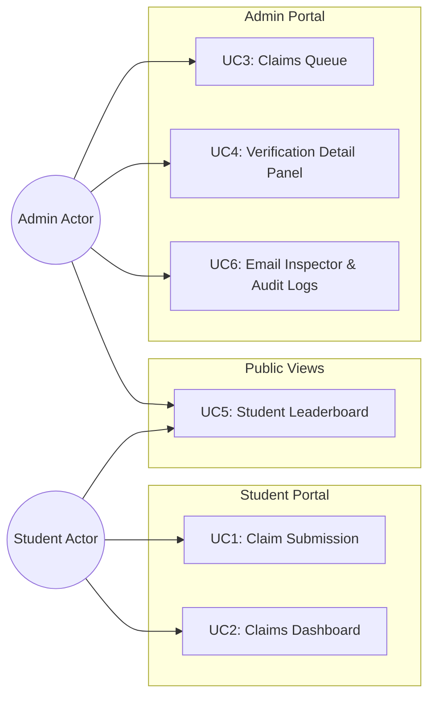
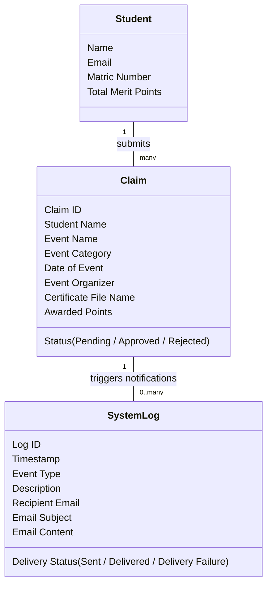
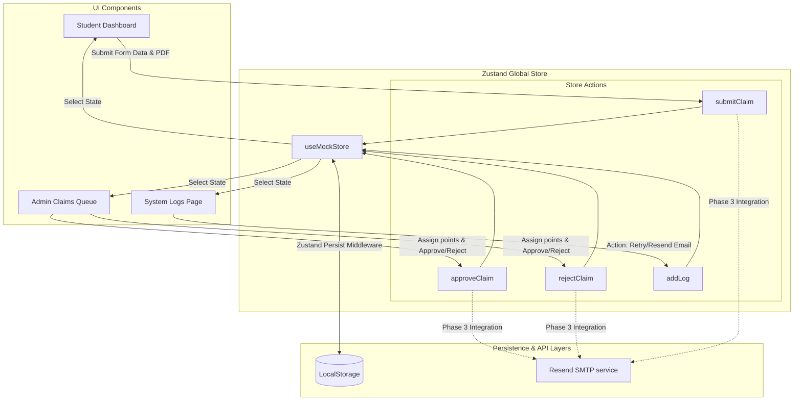

# Merit Activity Records System (MARS): Formal Assignment Report

---

## 1. Introduction

### 1.1 Academic Assignment Scope
This report documents the architectural design, implementation workflow, and iterative refinement of the **Merit Activity Records System (MARS)** (initially prototyped as "Community Merits"). Developed as a modern student merit tracking platform, this system allows students to submit claims for co-curricular achievements and enables administrators to verify, award points, and audit transactional email logs.

### 1.2 Focus on Extreme Prototyping Methodology (EPM)
Unlike conventional software projects that focus heavily on database setup or server deployment early on, this system was developed using the **Extreme Prototyping Methodology (EPM)**. Under EPM:
- The focus remains on rapid interface design, page transitions, and validating usability constraints.
- System complexities (such as databases and email dispatch servers) are deferred or simulated through high-fidelity mocks until user-facing designs are fully stabilized.
- Iterative cycles are used to test layout mechanics, user workflows, and system boundaries.

### 1.3 Iterative Evolution & Feedback Loops
Development is strictly managed through horizontal, iterative releases (Iteration 1 to Iteration 5). The system evolves by capturing user complaints and acceptance criteria in dedicated files under `docs/uat/` at the end of each iteration. These issues are systematically addressed in the subsequent iteration by moving across three implementation phases, ensuring that code updates are scoped, verified, and backward-compatible.

---

## 2. What We're Building

### 2.1 Functional Scope: The 6 Use Cases
The application is structured around six core use cases that define student and administrator interactions:

1. **UC1: Student Claim Submission**
   - Students access the dashboard and open the claim submission form.
   - Input fields: Event Name, Category, Date, Organizer, and PDF Certificate Proof.
   - Validation checks (compulsory fields, file size under 5MB) must be met before submission.
   - Certificate files are stored locally in the browser to enable instant administrative checkups.

2. **UC2: Student Claims Dashboard**
   - Displays a summary of the student's metrics (total approved merit points) and profile summary.
   - Renders a table of past claims, tracking their progress through status badges: `PENDING` (yellow), `APPROVED` (green), or `REJECTED` (red).

3. **UC3: Admin Claims Queue**
   - A dedicated verification inbox for system administrators.
   - Lists all claims in the system with status filters and pending claim counters.

4. **UC4: Admin Verification Detail Panel (Split-Screen)**
   - Selecting a claim from the queue splits the view:
     - **Left Panel**: Displays detailed metadata about the claim (student name, matric number, category, date, organizer).
     - **Right Panel**: A Certificate Preview box that renders the student's uploaded PDF proof on screen.
   - Administrators assign a numeric points value and click "Approve" or "Reject".

5. **UC5: Student Leaderboard**
   - A public page showing top performers with a visual podium for the top 3 students.
   - A complete ranking table displays all registered students.
   - Cumulative points and positions recalculate dynamically from approved claims.

6. **UC6: Transactional Email Notification System (Running Simulator)**
   - Automatically records logs of simulated email transmissions triggered by claim submissions and administrative decisions.
   - Features an **Email Inspector Drawer** that slides open from the right to display fully styled email templates.
   - Admins can trigger actions directly (Retry Delivery, Force Send, Resend Email) to update log statuses in real-time.

### 2.2 System Diagrams (Non-Technical Representation)

#### 2.2.1 Use Case Diagram
The diagram below details how actors interact with each use case in the system:



#### 2.2.2 Data Entity Diagram (Simplified Data Models)
Below is the conceptual layout of the data models used in the system, described in plain language for non-technical stakeholders:



---

## 3. How We're Building It (Methodology & Architecture)

### 3.1 Technology Stack & Tools
* **Next.js**: Supports page layouts, page transitions, and routing architecture.
* **Tailwind CSS v4**: Provides layout utilities for responsive web interfaces.
* **Zustand**: A client-side global memory state store that coordinates data across pages.
* **LocalStorage**: Stores user preferences and claim details locally in the browser so data is saved between refreshes.
* **Resend Service**: Sends actual email alerts to testing inboxes in production.
* **pdfjs-dist**: Renders PDF certificate documents on the browser screen without layout breakages.

### 3.2 EPM Horizontal Phase Model
Rather than building features vertically (where databases, UI, and integrations are built at once for a single page), MARS is built **horizontally** across three engineering phases:

1. **Phase 1: Static UI**: Create screen mockups and routes. Local state handles component inputs, resetting upon page reload.
2. **Phase 2: Zustand Sync**: Connect views using a shared client-side memory store, enabling data synchronization (e.g., student submission immediately appears in the admin queue). State resets on refresh.
3. **Phase 3: Persistence / Live Integration**: Enable storage persistence in the store, handle hydration matching, and replace mock logic with live APIs (e.g., Resend SMTP).

### 3.3 Comparative Analysis: EPM vs. Vertical Agile Slicing
To evaluate the methodology, the table below highlights the trade-offs experienced during development:

| Dimension | Vertical Slicing (Traditional Agile) | Horizontal Slicing (EPM) |
| :--- | :--- | :--- |
| **Development Sequence** | Build DB schema $\rightarrow$ API endpoints $\rightarrow$ Frontend UI per feature. | Build UI for all features $\rightarrow$ Central Client-Side State $\rightarrow$ DB Integration. |
| **User Feedback Loop** | Delayed (User can only test features after the backend is complete). | Rapid (User reviews visual mockup and layout in Phase 1). |
| **UX/Design Risk** | High (Changes to UI layout require modifying database tables). | Low (UX refined and approved before the DB schema is locked). |
| **Team Blockers** | Developers are blocked waiting for database/API specifications. | Frontend, state, and QA developers work concurrently. |

### 3.4 Data Flow Architecture
The diagram below illustrates the data lifecycle: UI interactions mutate the client-side state store, which persists to local storage and triggers external email dispatches in Phase 3.



---

## 4. Who Is Building What: Simulation Delegation Plan

To model a professional software environment, our 6-member team simulated a **Client-Developer Swap Model** across the iterations:

```
[Iterations 1-2] : Team A (M1, M2, M3) = Developers  │  Team B (M4, M5, M6) = Users & QA
──────────────────────────────────────────────────────────────────────────────────────
[Iterations 3-5] : Team A (M1, M2, M3) = Users & QA  │  Team B (M4, M5, M6) = Developers
```

### 4.1 First Half (Iterations 1 & 2)
*   **Team Developers (Members 1, 2, 3)**:
    - **Member 1 (Setup & Switcher)**: Scaffolds the Next.js and Tailwind v4 environment, creates page shells, and builds the progressive iteration switcher.
    - **Member 2 (Student Portal UI)**: Implements Student Dashboard forms and tables.
    - **Member 3 (Admin Portal UI)**: Builds the Admin claims list, split-screen verification queue, and System Logs page.
*   **Team Users / QA (Members 4, 5, 6)**:
    - Test the deployed prototypes at the end of each phase.
    - Compile user feedback and write down the complaints in UAT logs.

### 4.2 Second Half (Iterations 3, 4, & 5)
*   **Team Developers (Members 4, 5, 6)**:
    - **Member 4 (Zustand State Store)**: Manages store variables, creates actions, and wires `localStorage` persistence.
    - **Member 5 (Interactivity & Integrations)**: Connects UI events to store hooks, handles PDF.js client-side rendering, and integrates Resend API routing.
    - **Member 6 (Quality Assurance & Calculations)**: Writes dynamic points calculations, enforces form checks, and adds table pagination.
*   **Team Users / QA (Members 1, 2, 3)**:
    - Perform systematic testing, audit code quality, and write UAT feedback logs.

---

## 5. Documented Building Process and Proof of Work

The development workflow is driven by feedback loops where user complaints logged in iteration $x$ are resolved horizontally in iteration $x+1$ across EPM phases.

### 5.1 Iteration 1 (Transition to v2.3)
*   **User Complaints (`docs/uat/iteration-1.md`)**:
    1. *Generic Branding*: Title "Community Merits" felt generic.
    2. *Outdated Matriculation Numbers*: Matric formats were legacy formats (e.g., `U232...`).
    3. *Browser-Default Date Input*: Standard HTML date picker caused layout differences across browsers.
*   **EPM Phase Resolutions**:
    - **Phase 1 (Static UI)**: Created mockups of the custom Calendar popover and renamed the brand to "MARS".
    - **Phase 2 (Zustand Sync)**: Configured the iteration switcher to update layouts based on iteration.
    - **Phase 3 (Persistence)**: Initialized new alphanumeric matric formats in persistent state.
*   **UI Layout Snapshots**:
    - `[UI Screenshot Placeholder: Iteration 1 Student Dashboard showing legacy date field]`
    - `[UI Screenshot Placeholder: Iteration 2 Student Dashboard showing custom calendar popover]`
*   **UAT Test Execution**:
    
    | Test ID | Action Performed | Expected Behavior | Actual Behavior | Status |
    | :--- | :--- | :--- | :--- | :--- |
    | T1.1 | Switch to Iteration 2 | Brand name updates to MARS. | Brand name updates to MARS. | Pass |
    | T1.2 | Select date field | Custom calendar popover slides open. | Custom calendar popover slides open. | Pass |

---

### 5.2 Iteration 2 (Transition to v3.3)
*   **User Complaints (`docs/uat/iteration-2.md`)**:
    1. *Page Header Inconsistency*: Header link read "Audit Logs" but page title said "System Logs".
    2. *Filter Reset Button Layout*: Reset button shifted UI alignment when rendered.
    3. *Reload Flashing & Hydration Mismatch*: Reloading briefly flashed version states before loading client-side settings.
    4. *Certificate Proof Upload*: Upload forms did not allow students to submit a document, nor could admins view proof files.
*   **EPM Phase Resolutions**:
    - **Phase 1 (Static UI)**: Standardized page titles to "System Logs" and designed file dropzones.
    - **Phase 2 (Zustand Sync)**: Added Base64 image encoding to claim submissions and created state actions.
    - **Phase 3 (Persistence)**: Integrated the `isReady` flag in the phase context to render skeletons and resolve page flashing.
*   **UI Layout Snapshots**:
    - `[UI Screenshot Placeholder: Iteration 2 Audit Logs page with misaligned Reset button]`
    - `[UI Screenshot Placeholder: Iteration 3 System Logs page with aligned Reset button and wider inspect drawer]`
*   **UAT Test Execution**:
    
    | Test ID | Action Performed | Expected Behavior | Actual Behavior | Status |
    | :--- | :--- | :--- | :--- | :--- |
    | T2.1 | Refresh page on Iteration 2 | Layout remains stable with loader skeleton; no version flashing. | Layout remains stable; no flashing. | Pass |
    | T2.2 | Upload PNG file on dashboard | File name is shown; Base64 preview renders on admin claims view. | File name is shown; Base64 preview renders. | Pass |

---

### 5.3 Iteration 3 (Transition to v4.3)
*   **User Complaints (`docs/uat/iteration-3.md`)**:
    1. *Leaderboards Value Inconsistency*: Leaderboard did not reflect actual approved claim points (Alice showing 120 points instead of 40).
    2. *Compulsory Form Fields*: Claims could be submitted with empty fields.
    3. *PDF File Preview*: Uploads failed to render on mobile browsers.
    4. *Table Pagination*: Large tables lacked navigation controls.
*   **EPM Phase Resolutions**:
    - **Phase 1 (Static UI)**: Designed pagination controls at the bottom of tables.
    - **Phase 2 (Zustand Sync)**: Hooked leaderboard rankings to sum up approved claim points dynamically.
    - **Phase 3 (Persistence)**: Integrated `pdf.js` library to parse PDF files and render them on an HTML5 canvas in the admin panel.
*   **UI Layout Snapshots**:
    - `[UI Screenshot Placeholder: Admin claims queue showing split-screen detail view with empty proof box]`
    - `[UI Screenshot Placeholder: Admin claims queue rendering student PDF certificate on canvas via PDF.js]`
*   **UAT Test Execution**:
    
    | Test ID | Action Performed | Expected Behavior | Actual Behavior | Status |
    | :--- | :--- | :--- | :--- | :--- |
    | T3.1 | Open Leaderboard | Alice Chen displays 40 points (sum of approved claims). | Alice displays 40 points. | Pass |
    | T3.2 | Select claims queue page | Table displays 5 items per page with navigation. | Table displays 5 items with navigation. | Pass |

---

### 5.4 Iteration 4 (Transition to v5.3)
*   **User Complaints (`docs/uat/iteration-4.md`)**:
    1. *Log Ingestion*: Action buttons in logs drawer did not create new audit log entries.
    2. *Dynamic Log Tracking*: Submission/review dispatches did not dynamically append logs.
    3. *Toaster Microcopy Compliance*: Toast messages contained banned words ("successfully") or exclamation marks.
    4. *PDF Size Constraint*: Students could upload PDFs larger than 5MB.
*   **EPM Phase Resolutions**:
    - **Phase 1 (Static UI)**: Updated email inspect drawer action buttons and positioned them in the footer.
    - **Phase 2 (Zustand Sync)**: Enabled actions (Resend, Force Send) to dynamically append new log objects.
    - **Phase 3 (Persistence)**: Connected live email alerts via Resend API and removed the manual simulation dispatch button.
*   **UI Layout Snapshots**:
    - `[UI Screenshot Placeholder: System Logs inspect drawer before width adjustment]`
    - `[UI Screenshot Placeholder: System Logs inspect drawer (45% width) with action buttons in footer]`
*   **UAT Test Execution**:
    
    | Test ID | Action Performed | Expected Behavior | Actual Behavior | Status |
    | :--- | :--- | :--- | :--- | :--- |
    | T4.1 | Click 'Resend Email' | A new email log is appended to the logs table in real time. | A new email log is appended in real time. | Pass |
    | T4.2 | Upload 6MB PDF file | Blocked with toast: "File size must be smaller than 5MB". | Blocked with warning toast. | Pass |

---

### 5.5 Final Audit & Open UAT Issues (Iteration 5 Checkpoint)
At the end of Iteration 5, the QA Team conducted a final audit on the codebase and logged the following issues to be addressed in the next development cycle:

1. **Refactoring Omission**: While the directories `src/components/dashboard`, `src/components/admin/claims`, and `src/components/admin/logs` were created, the modular refactoring was not implemented; page files remain monolithic (700-1050 lines).
2. **Font Mismatch**: The email body preview drawer does not support font fallback options ('Courier New' for lower iterations vs 'Inter' for iteration 5).
3. **Toaster Logic Bug**: `closeButton={activeIteration < 5}` is reversed, disabling the close button in iteration 5 instead of enabling it.
4. **Matric Number Formatting Bug**: A conditional check in the leaderboard page (`activeIteration !== 2 && activeIteration !== 3`) prevents formatting matric numbers in Iteration 4 and 5.
5. **Claims Queue Points Bug**: A strict check (`activeIteration === 4`) in `admin/claims/page.tsx` causes points calculation to revert to `0` in Iteration 5.

---

## 6. What Next (Roadmap)

To transition from the current high-fidelity prototype to a production-ready system, the following roadmap is proposed:

### 6.1 Database & API Migration
- **ORM & Server Actions**: Replace the client-side memory store with a database using Prisma ORM mapping to a hosted PostgreSQL database.
- **Server-Side Validation**: Convert state actions (`submitClaim`, `approveClaim`) into Next.js Server Actions with server-side validation.

### 6.2 Object Cloud Storage
- **Object Storage Service**: Replace database Base64 storage with AWS S3 or Vercel Blob storage for PDF uploads.
- **Signed URLs**: Store file URLs in the database and access them securely using signed URLs.

### 6.3 Authentication & Authorization
- **Role-Based Access Control (RBAC)**: Integrate Clerk or NextAuth to secure dashboard routes.
- **Access Restrictions**: Lock the Student Dashboard to authorized students and secure administrative routes behind verified staff roles.
